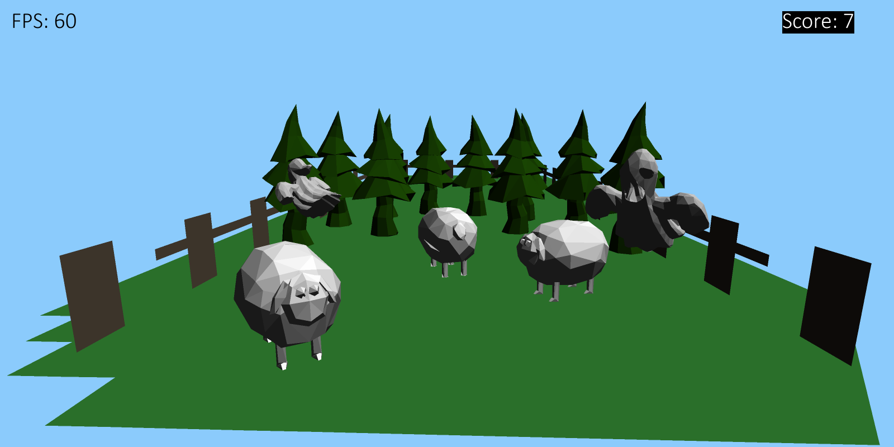

# manic-mansion-3d

Laget som del av prosjektarbeid i IT2.

Laget ekslusivt med pygame og numpy.

Bruk _wasd_ til å bevege, piltastene til å se rundt.
Trykk _escape_ for å gå ut.

Målet med spillet er å få så mange poeng som mulig.
Du får poeng for å hente sauer, og sette de fra deg på den andre siden. Spillet er over når man treffer et spøkelse.
